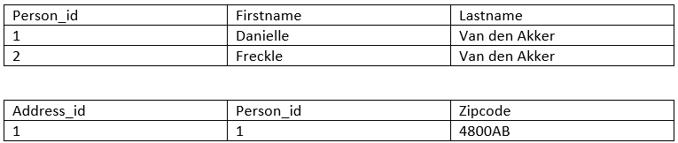

## Constraints

Je hebt de volgende constraints:

- NOT NULL (iets mag niet leeg zijn)
- CHECK (je kan zelf een check op een waarde zetten waar hij aan moet voldoen)
- UNIQUE
- PRIMARY KEY (iets waar je iemand aan kan identificeren en mag nooit null zijn)
- FOREIGN KEY

### Data verwijderen en meegeven aan foreign key

Je moet rekening houden met wat er moet gebeuren wanneer data met een relatie verwijderd wordt.

Bijvoorbeeld je hebt een persoon tabel en een adres tabel. Een persoon heeft een adres. Wat moet er gebeuren met het adresdata als de persoon verwijderd word.

De volgende vijf dingen kun je meegeven.

- RESTRICT
- NO ACTION
- SET NULL
- SET DEFAULT
- CASCADE

### Constraints - NO ACTION & RESTRICT (1)

Dit is de default waarde. Je kunt geen data verwijderen zolang er een relatie is.

```sql
CREATE TABLE press_officer (
    id INT GENERATED ALWAYS AS IDENTITY,
    company_id INT,
    full_name VARCHAR(255) NOT NULL,
    phone VARCHAR(15),
    email VARCHAR(100),
    PRIMARY KEY(id),
    CONSTRAINT fk_company
        FOREIGN KEY(company_id)
            REFERENCES company(id)
);
```

### Constraints - NO ACTION & RESTRICT (2)

Je kunt de default waarde ook uitgeschreven: `ON DELETE NO ACTION`.

```sql
CREATE TABLE press_officer(
    id INT GENERATED ALWAYS AS IDENTITY,
    company_id INT,
    full_name VARCHAR(255) NOT NULL,
    phone VARCHAR(15),
    email VARCHAR(100),
    PRIMARY KEY(id),
    CONSTRAINT fk_company
        FOREIGN KEY(company_id)
            REFERENCES company(id)
            ON DELETE NO ACTION
);
```

### Constraints - NO ACTION & RESTRICT (3)

NO ACTION en RESTRICT hebben soortgelijk gedrag.

```sql
CREATE TABLE press_officer(
    id INT GENERATED ALWAYS AS IDENTITY,
    company_id INT,
    full_name VARCHAR(255) NOT NULL,
    phone VARCHAR(15),
    email VARCHAR(100),
    PRIMARY KEY(id),
    CONSTRAINT fk_company
        FOREIGN KEY(company_id)
            REFERENCES company(id)
            ON DELETE RESTRICT
);
```

Het resultaat voor NO ACTION en RESTRICT: stel dat je een persoonstabel en een adrestabel hebt. Het adrestabel heeft een id naar persoon en je wilt persoon met dat specifieke id verwijderen, dan moet je eerst alle foreign keys van die persoon verwijderen, voordat je de persoon zelf kan verwijderen.



Wannneer persoon 1 is gekoppeld aan het adres met id 1 en je wilt person 1 verwijderen, dan krijg je een foutmelding terug van de database dat er nog een relatie bestaat in de adrestabel. Alleen de connectie met het adres moet je verwijderen. Je kan bijvoorbeeld Person_id 1 in het adrestabel op 0 zetten en dan kun je persoon 1 verwijderen in persoontabel door het versturen van een query.

### Constraints - SET NULL

De waarde van de foreign key wordt op NULL gezet: `ON DELETE SET NULL`.

In het voorbeeld hierboven kun je met deze actie persoon 1 verwijderen.

```sql
CREATE TABLE press_officer(
    id INT GENERATED ALWAYS AS IDENTITY,
    company_id INT,
    full_name VARCHAR(255) NOT NULL,
    phone VARCHAR(15),
    email VARCHAR(100),
    PRIMARY KEY(id),
    CONSTRAINT fk_company
        FOREIGN KEY(company_id)
            REFERENCES company(id)
            ON DELETE SET NULL
);
```

Nadeel: je bent de database aan het vervuilen want je zet regels op NULL die je niet meer gebruik.

### Constraints - SET DEFAULT

Zet de waarde van de foreign-key naar een ingestelde default waarde.

Als je een tabel aanmaakt kun je een default waarde meegeven. Bij het aanmaken kun je bijvoorbeeld aangeven dat `company_id INT` een default waarde krijgt.

Op het moment dat dan uit het voorbeeld persoon 1 wordt verwijderd dan wordt het op de default waarde gezet,

```sql
CREATE TABLE press_officer(
    id INT GENERATED ALWAYS AS IDENTITY,
    company_id INT,
    -- overige weggelaten.
    PRIMARY KEY(id),
    CONSTRAINT fk_company
        FOREIGN KEY(company_id)
            REFERENCES company(id)
            ON DELETE SET DEFAULT
);
```

### Constraints - CASCADE

Deze is belangrijk! Wanneer je een rij uit de hoofdtabel verwijderd, worden alle relaties ook verwijderd!

```sql
CREATE TABLE press_officer(
    id INT GENERATED ALWAYS AS IDENTITY,
    company_id INT,
    -- overige weggelaten.
    PRIMARY KEY(id),
    CONSTRAINT fk_company
        FOREIGN KEY(company_id)
            REFERENCES company(id)
            ON DELETE CASCADE
);
```

### Alter table

Achteraf een foreign toevoegen doe je met `alter table`.

```sql
ALTER TABLE child_table
    ADD CONSTRAINT constraint_name
    FOREIGN KEY (fk_columns)
    REFERENCES parent_table (parent_key_colWumns);
```