## CRUD

CRUD is het plaatsen van de data in de database. Er zijn vier manieren hoe je kunt werken met een database: create (insert), read (select), update en delete.

Aan de hand van een voorbeeld doorlopen we de verschillende benaderingen. Maak een nieuwe tabel aan met de volgende code en zet deze in de `Query Editor`.

```sql
CREATE TABLE IF NOT EXISTS film (
    code char(5) PRIMARY KEY,
    title varchar(40) NOT NULL,
    length integer NOT NULL,
    date_prod date,
    kind varchar(10)
);
```
### Create (of insert): toevoegen van nieuwe gegevens

Met create bedoelen we niet `CREATE TABLE`. We bedoelen een entiteit toevoegen aan de database, dus een nieuwe rij eraan toevoegen. Dit doen we met een insert statement: `INSERT INTO`.

```sql
INSERT INTO table_name (column1, column2, …)
VALUES (value1, value2, …)
```

Je begint met `INSERT INTO`, dan de `tabel naam` en vervolgens tussen haakjes `()` kies je de kolomnamen waar je iets in wilt zetten. Op het moment dat je geen kolomnamen definieërt moet je voor elke kolomnaam een waarde (`values`) meegeven, zoals in het voorbeeld hieronder.

```sql
INSERT INTO film
VALUES ('1-abc', 'The Hobbit', 180, '2020-01-01', 'fantasy')
```

Wanneer je dit met kolommen wilt doen, gebruik je de volgende code.

```sql
INSERT INTO film (code, title, length)
VALUES ('2-abc', 'The Desolation of Smaug', 181);
```

In de tabel `film` zijn twee nieuwe regels toegevoegd.

Om dit te zien klik je op `film`, rechter muisknop `View/Edit Data` en dan `All Rows`.

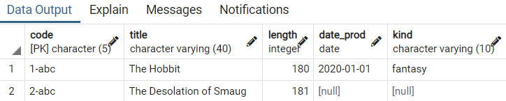

We voegen nog wat extra data toe.

```sql
INSERT INTO film
VALUES ('3-abc', 'The Dobbit', 144, '2020-02-01', 'fantasy');
INSERT INTO film
VALUES ('4-abc', 'The Wobbit', 121, '2020-03-01', 'fantasy');
INSERT INTO film
VALUES ('5-abc', 'The Lobbit', 169, null, 'scifi');
INSERT INTO film
VALUES ('6-abc', 'The Kobbit', 225, '2020-01-01', 'action');
```

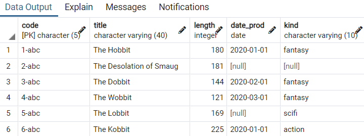

### Read (of select): opvragen van gegevens

Wanneer je iets uit de data wilt halen, begin je met drie woorden: <br/>
SELECT: van welke kolommem wil je de data terug hebben<br/>
FROM: om welke tabel gaat het<br/>
WHERE: aan welke voorwaarde moet de data voldoen<br/>

We selecteren alle informatie van de films in de film tabel van het genre fantasy. Het sterretje `*` betekend selecteer alle kolommen.

```sql
SELECT *
FROM film
WHERE kind = 'fantasy';
```

Wanneer je deze data uitvoert in `Query Editor` komt dit gelijk in de `Data Output` te staan.

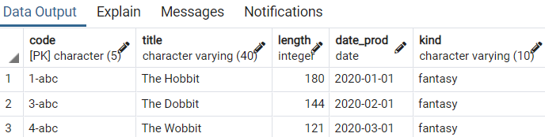

Tip!

Als je iets met een tabel moet gaan doen, je wilt informatie uitlezen of informatie toevoegen, doe dan altijd...

```sql
SELECT *
FROM film
```

...want dan krijg je alle informatie en alle kolomnamen die bij die tabel horen. Op basis hiervan kun je de rest van je SQL statement schrijven.


We selecteer alle codes en length van de fantasy films.

```sql
SELECT code, length
FROM film
WHERE kind = 'fantasy';
```

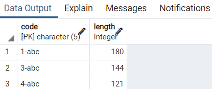

We selecteren alle films korter dan 180 minuten.

```sql
SELECT *
FROM film
WHERE length < 180;
```

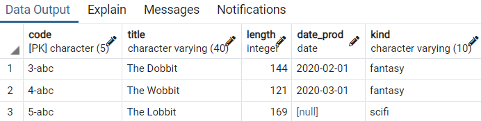

We selecteren alle films na 1 februari 2020.

```sql
SELECT *
FROM film
WHERE date_prod < '2020-02-01';
```

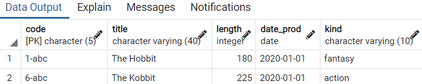

### Update: wijzigen van gegevens

Je wilt aan de entiteit zelf niets aanpassen maar je wilt wel bijvoorbeeld een e-mailadres aanpassen.

Bij update begin je met drie woorden: <br/>
UPDATE: de tabelnaam<br/>
SET: kolomnamen en nieuwe waardes<br/>
WHERE: we doen hier een clausule dat het maar bij één entiteit is<br/>

Verander de titel van de film met code 3-abc naar Die Hard.

```sql
UPDATE film
SET title = 'Die Hard'
WHERE code = '3-abc';
```

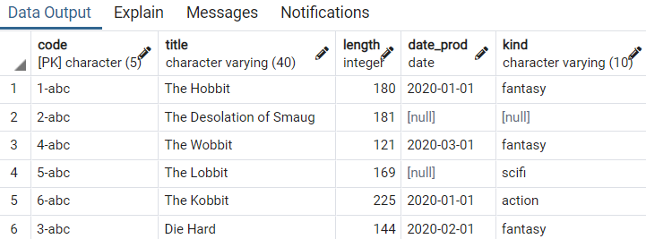

Verander fantasy naar epic.

```sql
UPDATE film
SET kind = 'epic'
WHERE kind = 'fantasy';
```

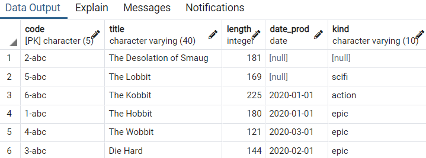

Verander length en title van 1-abc.

```sql
UPDATE film
SET length = 1, title = 'Apollo 13'
WHERE code = '1-abc';
```

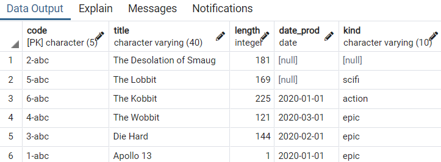

### Delete: verwijderen van gegevens

Bij delete begin je altijd met: <br/>
DELETE FROM: de tabelnaam <br/>
WHERE: de conditie

Verwijder de film met de title 'The Kobbit'.

```sql
DELETE FROM film
WHERE title = 'The Kobbit';
```

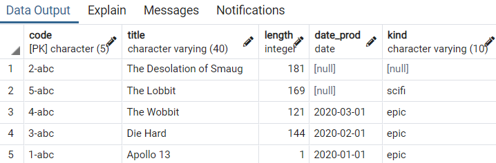

Voor het deleten van de volledige tabel gebruik je de volgende code. 

```sql
DELETE FROM film;
```

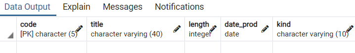
