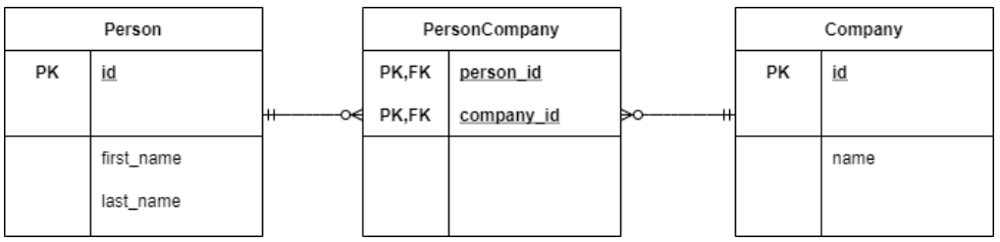

## Oefenen met Foreign Key

Bekijk onderstaande tabellen. Bedenk aan welke tabel je de kolom met de foreign key moet toevoegen. Je kunt de tabellen middels markdown aanpassen.

### Voorbeeld

Bekijk onderstaande tabellen. Pas deze aan met de volgende regels:

* Dit is een 0 tot 1 relatie.
* Een address kan niet bestaan zonder een relatie met een persoon.

##### Person

| id   | first_name | last_name |
| :--- | :--------- | --------- |
|1| Nick | Stuivenberg  
|2| Nova | Eeken  
|3| Sjaak | Polak  
|4| Frederik | de Kleine

##### Address

| id   | street_name | number | zip  |
| :--- | :---------- | :----- | :--- |
1 | Zonnebaan | 9 | 3578AB  
2 | Zonnebaan | 10 | 3579AB  
3 | Zonnebaan | 11 | 3570AB  
4 | Zonnebaan | 12 | 3571AB

#### Uitwerking voorbeeld:

| id   | first_name | last_name |
| :--- | :--------- | --------- |
|1| Nick | Stuivenberg  
|2| Nova | Eeken  
|3| Sjaak | Polak  
|4| Frederik | de Kleine

##### Address

| id | street_name| number | zip | user_id
| :--- | :--- | :--- | :--- | :---
1 | Zonnebaan | 9 | 3578AB | 4  
2 | Zonnebaan | 10 | 3579AB | 3  
3 | Zonnebaan | 11 | 3570AB | 1  
4 | Zonnebaan | 12 | 3571AB | 2  

### Opdracht 1

Bekijk onderstaande tabellen. Pas deze aan met de volgende regels:

* Dit is een 0 tot 1 relatie.
* Zowel hond als persoon kunnen los van elkaar bestaan.

##### Person

| id   | first_name | last_name |
| :--- | :--------- | :--------- |
|1| Nick | Stuivenberg  
|2| Nova | Eeken  
|3| Sjaak | Polak  
|4| Frederik | de Kleine

##### Dog

| id | name | species |
| :--- |:--- | :--- |
| 1 | Dotje | Terrier
| 2 | Nelis | Labrador
| 3 | Bram | Labradoodle
| 4 | Frank | D. herder
| 5 | Lassie | Wiener

#### Jouw uitwerking #1

Het is een 0 tot 1 relatie, ze mogen een relatie met elkaar hebben maar dit hoeft niet. Ook mogen ze los van elkaar bestaan. Het maakt dus niet uit waar je de foreign key gaat bijhouden.

<i>Optie 1: bijhouden in Person</i>

| id   | first_name | last_name | dog_id
| :--- | :--------- | :--------- | :----- |
|1| Nick | Stuivenberg | 1  
|2| Nova | Eeken | 2  
|3| Sjaak | Polak | 2  
|4| Frederik | de Kleine | null

| id | name | species |
| :--- |:--- | :--- |
| 1 | Dotje | Terrier
| 2 | Nelis | Labrador
| 3 | Bram | Labradoodle
| 4 | Frank | D. herder
| 5 | Lassie | Wiener

<i>Optie 2: bijhouden in Dog</i>

| id   | first_name | last_name |
| :--- | :--------- | :--------- |
|1| Nick | Stuivenberg  
|2| Nova | Eeken  
|3| Sjaak | Polak  
|4| Frederik | de Kleine

| id | name | species | owner_id |
| :--- |:--- | :--- | :--- |
| 1 | Dotje | Terrier | 1
| 2 | Nelis | Labrador | 2
| 3 | Bram | Labradoodle | 3
| 4 | Frank | D. herder | 4
| 5 | Lassie | Wiener | null

### Opdracht 2

Bekijk onderstaande tabellen. Pas deze aan met de volgende regels:

* Dit is een 0 tot N (nul tot meer) relatie.
* Een eigenaar kan meerdere honden hebben
* Een hond heeft altijd 1 eigenaar.

##### Person

| id   | first_name | last_name |
| :--- | :--------- | --------- |
|1| Nick | Stuivenberg  
|2| Nova | Eeken  
|3| Sjaak | Polak  
|4| Frederik | de Kleine

##### Dog

| id   | name | species |
| :--- | :--------- | --------- |
|1| Dotje | Terrier  
|2| Nelis | Labrador  
|3| Bram | Labradoodle  
|4| Frank | D. herder
|5| Lassie | Wiener

#### Jouw uitwerking #2

Het is een 0 tot meer relatie. In de dog tabel wil je bijhouden wie de eigenaar is. De hond heeft altijd maar 1 eigenaar en de eigenaar kan meer honden hebben.

| id   | name | species | owner_id |
| :--- | :--------- | :--------- | :---- | 
|1| Dotje | Terrier | 1 
|2| Nelis | Labrador | 1 
|3| Bram | Labradoodle | 2 
|4| Frank | D. herder | 3
|5| Lassie | Wiener | 4

### Opdracht 3

Bekijk onderstaande tabellen. Pas deze aan met de volgende regels:

* Een persoon kan voor 0 of 1 bedrijf werken.
* Een bedrijf kan meerdere mensen in dienst hebben.
* Een bedrijf moet een address hebben.
* Een address moet bij een persoon of bedrijf horen.
* Een persoon is niet verplicht een adres te hebben.

##### Person

| id   | first_name | last_name | address_id |
| :--- | :--------- | :--------- | :------ |
|1| Nick | Stuivenberg | 2  
|2| Nova | Eeken | null  
|3| Sjaak | Polak | null  
|4| Frederik | de Kleine | null

##### Address

| id   | street_name | number | zip  |
| :--- | :---------- | :----- | :--- |
1 | Zonnebaan | 9 | 3578AB |  
2 | Zonnebaan | 10 | 3579AB |  
3 | Zonnebaan | 11 | 3570AB |  
4 | Zonnebaan | 12 | 3571AB |  

##### Company

| id   | name | address_id |
| :--- | :--- | ---------- |
1 | NOVI | 1  
2 | LOI | 3  
3 | NCOI | 4  

#### Jouw uitwerking #3

Person en Company hebben een relatie met address: address_id. We moeten er voor zorgen dat er een relatie komt tussen Company en Person. Een Company kan meerdere personen in dienst hebben, dus de Company is degene die een lijst heeft en Person hoort altijd bij één bedrijf. We zetten de foreign key bij Person. Daar kun je in bijhouden waar de persoon in kwestie bij werkt.

| id   | first_name | last_name | address_id | company_id
| :--- | :--------- | :--------- | :------ | :------ |
|1| Nick | Stuivenberg | 2 | 1 
|2| Nova | Eeken | null  | 1 
|3| Sjaak | Polak | null | 3 
|4| Frederik | de Kleine | null | 4

### Opdracht 4

Bedenk zelf de tabellen met de volgende regels:

* Een Persoon kan 0 tot meerdere duiven hebben
* Een duif heeft altijd 1 eigenaar.

#### Jouw uitwerking #4

Een Persoon kan 0 tot meer duiven hebben, dus Persoon heeft een lijst met duiven. Een duif hoort altijd bij één persoon.

| id   | first_name | last_name |
| :--- | :--------- | --------- |
|1| Nick | Stuivenberg  
|2| Nova | Eeken  
|3| Sjaak | Polak  
|4| Frederik | de Kleine

| ringnummer | naam | person_id |
| :--- | :---- | :----- |
| 1 | duif 1 | 1 |
| 2 | duif 2 | 1 |
| 3 | duif 3 | 3 |

### Opdracht 5 (Doordenkertje)

Bekijk onderstaande tabellen. Pas deze aan met de volgende regels:

* Een persoon kan voor 0 tot meerdere bedrijven werken.
* Een bedrijf heeft 0 tot meerdere werknemers in dienst.

##### Person

| id   | first_name | last_name |
| :--- | :--------- | --------- |
|1| Nick | Stuivenberg  
|2| Nova | Eeken  
|3| Sjaak | Polak  
|4| Frederik | de Kleine

##### Company

| id   | name |
| :--- | :--- |
1 | NOVI |  
2 | LOI |  
3 | NCOI |  

#### Jouw uitwerking #5

Je kan in tabel Company bijhouden wie er voor je werkt, maar dan kun je maar 1 persoon bijhouden. Hetzelfde geldt voor Person, je kan daar het bedrijf toevoegen, maar dan kan een person maar voor 1 bedrijf werken.

De standaardregel in databases is op het moment dat je een meer op meer relatie hebt is er altijd een koppeltabel. Deze koppeltabel:
- bevat 2 Foreign Keys
- één Primary Key op basis van de twee foreign keys (een primary key kan uit meerdere velden/kolommen bestaan)

De hele tabel is een many to many relatie, maar omdat er een koppeltabel er tussen zit wordt het een one to many naar one to many relatie (van Person naar PersonCompany en van Company naar PersonCompany): PersonCompany hoort altijd bij één persoon en zo'n persoon kan meerdere PersonCompany hebben. Een Company kan meerdere PersonCompany relaties hebben, maar de PersonCompany hoort altijd bij één Company.

### Opdracht 6

Bekijk onderstaande tabellen. Pas deze aan met de volgende regels:

* Een Persoon heeft 0 tot meerdere honden
* Een hond heeft 0 tot meerdere baasjes

##### Person

| id   | first_name | last_name |
| :--- | :--------- | --------- |
|1| Nick | Stuivenberg  
|2| Nova | Eeken  
|3| Sjaak | Polak  
|4| Frederik | de Kleine

##### Dog

| id   | name | species |
| :--- | :--------- | --------- |
|1| Dotje | Terrier  
|2| Nelis | Labrador  
|3| Bram | Labradoodle  
|4| Frank | D. herder
|5| Lassie | Wiener

### Opdracht 7a

Bedenk zelf de tabellen met de volgende regels:

* Een winkel heeft meerdere producten.
* Een product kan in meerdere winkels liggen.

### Opdracht 7b

Breidt bovenstaande uitwerking uit:

* Een winkel heeft meerdere producten.
* Een product kan in meerdere winkels liggen.
* Per winkel wil je een product-voorraad bijhouden.

#### Jouw uitwerking #7a

#### Jouw uitwerking #7b

### Opdracht 8

Bekijk onderstaande tabellen. Pas deze aan met de volgende regels:

* Een persoon heeft 0 tot meerdere adressen.
* Een adres kan bij 1 tot meerdere personen horen.
* Van elk adres wordt de begin- en einddatum bijgehouden.
* Bij een huidig adres is de einddatum null (leeg)

##### Person

| id   | first_name | last_name |
| :--- | :--------- | --------- |
|1| Nick | Stuivenberg  
|2| Nova | Eeken  
|3| Sjaak | Polak  
|4| Frederik | de Kleine

##### Address

| id   | street_name | number | zip  |
| :--- | :---------- | :----- | :--- |
1 | Zonnebaan | 9 | 3578AB  
2 | Zonnebaan | 10 | 3579AB  
3 | Zonnebaan | 11 | 3570AB  
4 | Zonnebaan | 12 | 3571AB

#### Jouw uitwerking #8

### Opdracht 9

Maak de volgende tabellen en relaties.

* **Factuur:** datum, isBetaald
* **Product:** id, naam, prijs
* Een factuur bevat meerdere producten. Een product kan op meerdere facturen voorkomen.
* Per factuur wil je ook de hoeveelheid van het product weten.

#### Jouw uitwerking #9