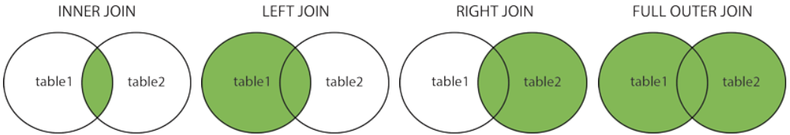

## Join

Je hebt verschillende joins op een postgresql database.

- (Inner) join: Geeft alleen de data terug die voor allebei de tabellen samen geldt
- Left (outer) join: retourneert alle records uit de linker tabel, en de overeenkomende records uit de rechter tabel
- Right (outer) join: Geeft als resultaat alle records uit de rechtertabel en de overeenkomende records uit de linkertabel
- Full (outer) join: Geeft als resultaat alle records wanneer er een overeenkomst is in de linker- of de rechtertabel

  

De inner join wordt het vaakst gebruikt.

### Voorbeeld

We hebben een Person die heeft een meer tot meer relatie met Company. Dus een Person kan voor meerdere Company's werken en een Company kan meerdere Persons hebben. Dit houden we bij in de PersonCompany tabel. 

Zowel Person als Company hebben een relatie met Address, ze kunnen allebei een Address hebben.


We willen alle Persons ophalen die in Breda wonen. Dan hebben we informatie uit twee tabellen nodig: Person en Address. Dit doen we als volgt.

```sql
SELECT person.first_name, person.last_name, address.city
FROM address
INNER JOIN person ON address.id=person.address_id
WHERE address.city = 'Breda';
```

We beginnen altijd met SELECT, FROM, INNER JOIN en WHERE. <br/>
- Wat wil je selecteren met SELECT: kolom first_name uit person tabel, kolom last_name uit person tabel en kolom city uit address tabel. <br/>
- Bij FROM zet je één van de tabellen, je had er ook person kunnen neerzetten. <br/>
- Dan doen we INNER JOIN en daar zetten we achter de andere tabel en wat we willen vergelijken: `address.id=person.address_id` (waar de id in address gelijk is aan de id address van person). <br/>
- In de WHERE zeggen we waar hij op moet filteren, dus waar `address.city` Breda is.
