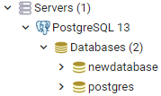
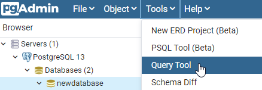
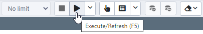
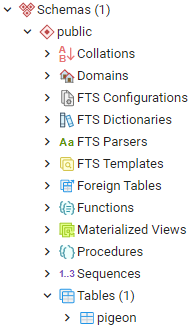
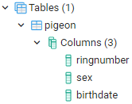

## PostgreSQL

<i>Je zegt: poost-kress-Q-L</i>.

Een database heeft een eigen taal om daar data uit te halen. Bijna alle relationele databases hebben SQL als onderliggende taal om data eruit te halen. 

Relationeel wilt zeggen dat de tabellen relaties met elkaar hebben. Bijvoorbeeld tabel docent en tabel persoon hebben een relatie met elkaar. Tabel docent bestaat uit een persoon. Een persoon kan wel of geen docent zijn, maar we kunnen geen docent hebben die niks is, daar heb je persoon voor nodig.

Elke database heeft zijn eigen dialect van SQL. Zo hebben we bijvoorbeeld postresql dat we gebruiken in PGAdmin om database in te richten en data te muteren.

PostgreSQL is open source.

### Download PostgreSQL & eerste stappen

Download PostgreSQL hier: https://www.postgresql.org/download/.

Als je het geïnstalleerd hebt, open `pgAdmin4`. Klik op `Servers`, klik dan `PostgreSQL` open en maak een nieuwe database aan onder de `Databases` map.

Wanneer je SQL wilt uitvoeren klik je op `Tools` en dan `Query Tool`. In `Query Editor` kun je je code uitvoeren en `Query History` zie je de geschiedenis.

Het opslaan van de data doe je met de `play` knop of `F5`.

Wanneer je een succes bericht hebt gekregen bij `Messages`, dan klik je op `Schemas` en dan komt hij in `Tables` te staan. In dit voorbeeld is een `pigeon` tabel gemaakt.

Deze `pigeon` heeft de volgende kolommen `ringnumber`, `sex` and `birthdate`.

Hiermee check je of alles goed in je database is terecht gekomen.