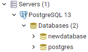

## Working with a Database

A database is a great medium for storing data. For now, we focus on using Relational databases: a database where relationships between data are defined in the model.

Learn more about databases [here](database.md). 

### Download PostgreSQL & first steps

Download PostgreSQL here: https://www.postgresql.org/download/.

When you have it installed open `pgAdmin4`. Click `Servers` open, then click `PostgreSQL` open and create a new database under the `Databases` folder.

