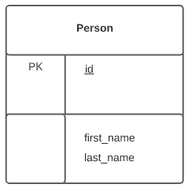
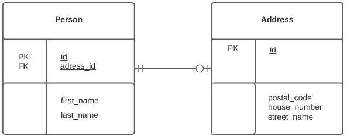
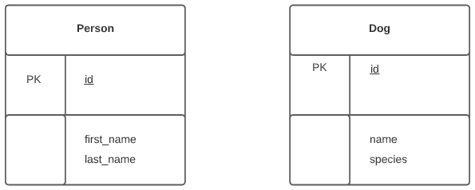
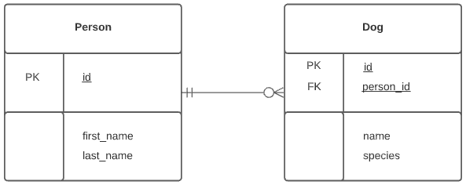

## UML & Tabel

In UML Java zet je de klasse naam bovenaan, dan de variabelen en als laatste de methodes.

Met UML kun je ook een database moduleren. Dit gaat als volgt te werk: je hebt een tabelnaam die je bovenaan zet, daaronder zet je de primary (pk) en de foreign key (fk) en daaronder zet je alle andere attributen die je hebt. In de meest simpele vorm hoef je er geen datatype bij te zetten.

### Person

Tabelnaam: Person  
Primary key: id  
Attributen: first_name en last_name

### Person - Address (1)

Tabelnaam: Person  
Primary key: id  
Attributen: first_name en last_name

Tabelnaam: Adress  
Primary key: id  
Attributen: postal_code, house_number en street_name

### Person - Address (2)

We hebben twee tabellen die geen relatie met elkaar hebben, die los van elkaar staan. Die relatie maak je door het toevoegen van een foreign key. Een foreign key is de verwijzing naar een andere tabel, hij verwijst meestal naar de primary key van de andere tabel.

Wanneer je het onderstaande zou uitschrijven: je hebt Person met id 1, met voornaam Daniëlle en achternaam van den Akker. Als foreign key geven we ook 1 en die 1 verwijst naar een adres met id 1, waar vervolgens de adres gegevens met postcode, huisnummer en straatnaam instaan.

Het teken bij Person betekend van 1 tot 1, dus in dit geval heeft een address altijd 1 persoon. En het teken bij address is 0 tot 1, dus een persoon heeft altijd 0 of 1 adres.

### Person - Dog (1)

Tabelnaam: Person  
Primary key: id  
Attributen: first_name en last_name

Tabelnaam: Dog  
Primary key: id  
Attributen: name en species

### Person - Dog (2)

Wanneer je zegt dat iemand meerdere honden kan hebben, dan houd je dit in tabel Dog bij. Je kan de foreign key het beste bij Dog neerzetten omdat je anders meerdere id's bij de Person gaan zetten.

Stel je houdt bij Person bij welke honden die heeft:

Persoon met id 1 (Danielle) daar hoort hond met id 1 (Freckle) bij.

Wat nou als de Person een tweede, derde of vierde hond wilt hebben? Gaan we dan voor elke hond een extra kolom toevoegen bij Person, dat je continue je tabel moet gaan aanpassen in de database? Nee, wat makkelijker is om te doen, is omdat een hond maar 1 eigenaar heeft om in de hond tabel bij te houden wie de eigenaar is. Je kunt in dit voorbeeld zeggen dat zowel hond 1 als hond 2 bij eigenaar 1 horen. Zo krjg je geen dubbele data is je database.

In een database UML doe je dit als volgt. Het teken bij database Dog is 0 tot meer, dus een persoon kan 0 tot meerdere honden hebben.  

